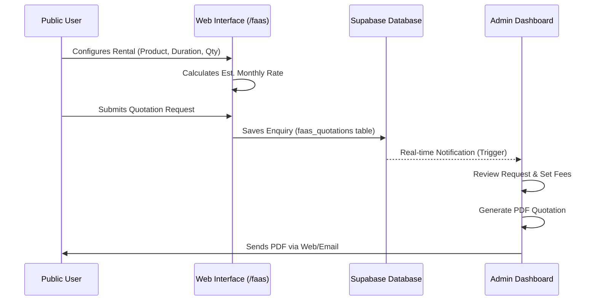
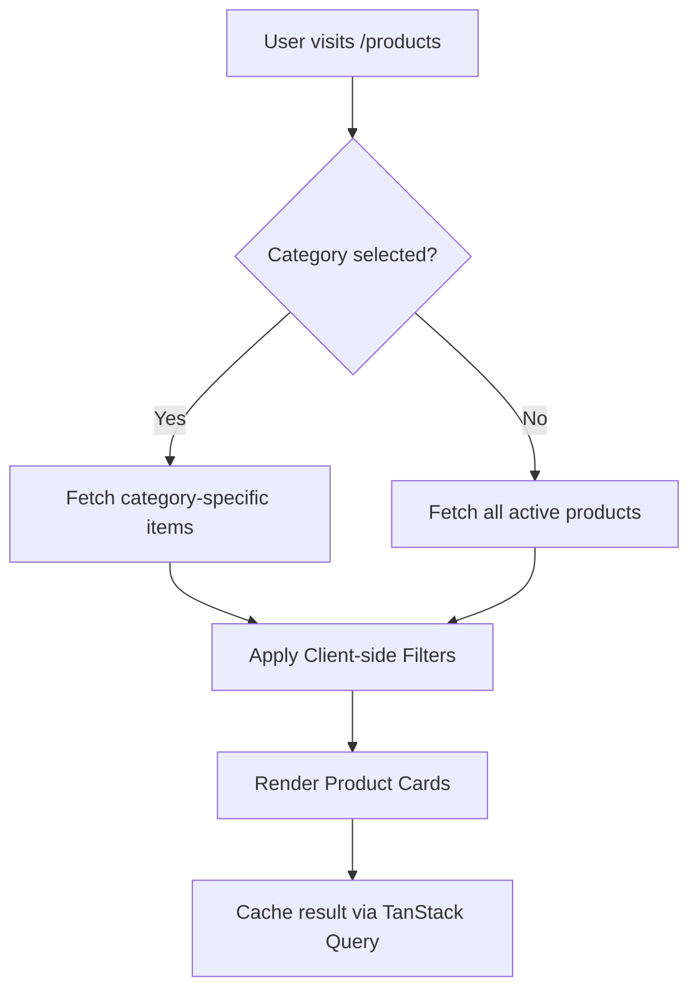

# 🌐 System Overview & Data Flow

This document explains the conceptual architecture and data flow of the **Steel Forge Hub** ecosystem.

## 🔄 Core Business Workflows

### 1. FaaS (Fabrication as a Service) Quotation Flow
This is the most complex workflow in the application, handling the rental subscription model.

### 2. Product Search & Discovery
How products are fetched and filtered with high efficiency.

---

## 🔒 Security Architecture (RLS)

We leverage Supabase **Row Level Security** to ensure data integrity without complex backend code.

| Table | Anonymous Access | Admin Access | Policy Detail |
| :--- | :--- | :--- | :--- |
| `products` | SELECT | ALL | `is_active = true` for public |
| `enquiries` | INSERT | ALL | Public can only submit, not read |
| `faas_quotations`| None | ALL | Restricted to `service_role` and Admins |
| `site_settings` | SELECT | ALL | Global configuration read-only for public |

---

## 🏗️ Technical Stack Deep Dive

### Frontend Architecture
- **State Persistence**: Custom hooks sync user preferences (Cart, Wishlist) to `localStorage`.
- **Interactions**: GSAP and Framer Motion handle scroll-triggered animations for a premium feel.
- **Form Handling**: Zod schemas validate inputs before submission to Supabase, reducing database errors.

### Database Schema Highlights
- **JSONB Structures**: Product specifications are stored in JSONB columns for maximum flexibility in industrial hardware data.
- **Relational Integrity**: Strict foreign key constraints between Categories, Products, and Images to prevent orphaned assets.
- **View Layer**: Complex analytics (revenue trends, popularity) are calculated via PostgreSQL Views for performance.

---

## 📊 Analytics Engine
The Dashboard uses **Recharts** to visualize data fetched from aggregated database queries.
- **Sales Trends**: Grouped by `created_at` (Daily/Weekly).
- **Enquiry Distribution**: Pie charts showing interest by Category.
- **Lead Conversion**: Tracking status transitions from `New` -> `Contacted` -> `Converted`.

---

## 🚀 Advanced Features (3D & AR)
1. **Renderer**: Uses `model-viewer` for cross-browser 3D support.
2. **Assets**: GLB files are served from Supabase Storage with optimized headers.
3. **AR Flow**: Handles WebXR for Android and Quick Look for iOS devices automatically.
